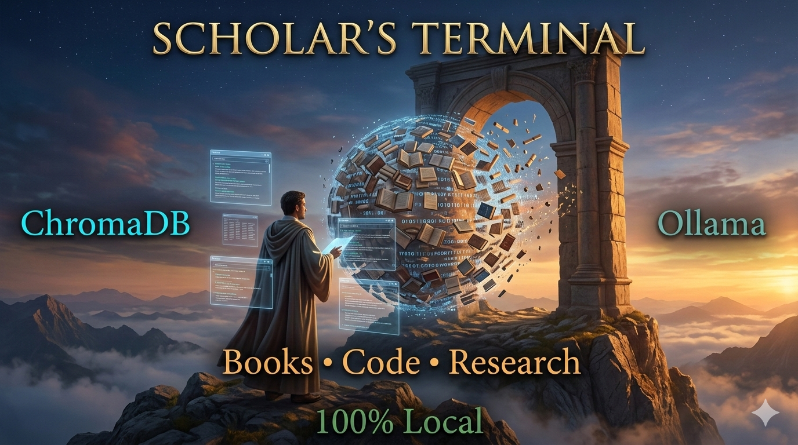

# Scholar's Terminal



**Transform your personal library into an AI-powered knowledge base.**

Search across thousands of books, research papers, code repositories, and documents using natural language queries. Get precise answers with source citations, and click to open PDFs exactly where the information appears.

[](https://opensource.org/licenses/MIT)
[](https://www.python.org/downloads/)

---

## ✨ Features

- **📚 Universal Search** - Query your entire library with natural language
- **🎯 Precise Citations** - Get exact page numbers and source references
- **🔗 Open in PDF** - Click to view diagrams and figures in context
- **🗂️ Multiple Sources** - Index books, code, papers, and documents together
- **⚙️ Easy Configuration** - YAML-based setup, no coding required
- **🔄 Resume Support** - Interrupted? Pick up where you left off
- **🖥️ Cross-Platform** - Works on Windows, macOS, and Linux

---

## 🚀 Quick Start

### Prerequisites

- Python 3.8+
- [Ollama](https://ollama.ai/) (for embeddings and LLM)
- Node.js 16+ (for frontend)

### 1. Install

```bash
git clone https://github.com/Vincent1949/scholars-terminal.git
cd scholars-terminal
pip install -r requirements.txt
```

### 2. Configure Your Library

Edit `database_config.yaml`:

```yaml
sources:
  - name: "My Books"
    path: "/path/to/your/books"  # ← Change this
    type: "books"
    enabled: true
    extensions: [.pdf, .txt, .md]
```

### 3. Build Database

**Windows:**
```bash
BUILD_DATABASE.bat
```

**Mac/Linux:**
```bash
chmod +x build_database.sh
./build_database.sh
```

### 4. Start Scholar's Terminal

```bash
# Backend
python Scholars_api.py

# Frontend (new terminal)
cd frontend
npm install
npm run dev
```

Visit http://localhost:5173

**That's it!** Start searching your knowledge base.

---

## 📖 Documentation

- **[Quick Start Guide](DATABASE_QUICKSTART.md)** - Get running in 3 steps
- **[Setup Guide](DATABASE_SETUP_GUIDE.md)** - Complete configuration reference
- **[Open PDF Feature](OPEN_PDF_FEATURE.md)** - View figures and diagrams in context
- **[Integration Guide](QUICK_INTEGRATION.md)** - Add features to existing setup

---

## 💡 Use Cases

### For Students
Index textbooks, lecture notes, and research papers. Ask questions and get answers with exact page references.

### For Developers
Search across technical books and your code repositories. Find solutions and examples instantly.

### For Researchers
Query thousands of papers at once. Discover connections across your research library.

### For Professionals
Build a knowledge base from technical documentation, reports, and reference materials.

---

## 🎯 How It Works

```
┌──────────────┐      ┌──────────────┐      ┌──────────────┐
│  Your Books  │  →   │   Build DB   │  →   │  Search UI   │
│  PDFs/Docs   │      │   ChromaDB   │      │    React     │
└──────────────┘      └──────────────┘      └──────────────┘
                             ↓
                      ┌──────────────┐
                      │    Ollama    │
                      │  Embeddings  │
                      │     LLM      │
                      └──────────────┘
```

1. **Index** - Point to your folders, build the database once
2. **Query** - Ask questions in natural language
3. **Discover** - Get answers with sources and page numbers
4. **Explore** - Click to open PDFs exactly where information appears

---

## 🔧 Configuration

### Multiple Sources

Index different types of content together:

```yaml
sources:
  - name: "Technical Books"
    path: "/books/programming"
    type: "books"
    enabled: true
  
  - name: "My Code"
    path: "/github/projects"
    type: "code"
    enabled: true
  
  - name: "Research Papers"
    path: "/papers"
    type: "research"
    enabled: true
```

### Supported File Types

- **Documents:** PDF, TXT, Markdown
- **Code:** Python, JavaScript, TypeScript, and more
- **Future:** EPUB, DOCX (via plugins)

### Advanced Settings

Control chunking, file sizes, and processing:

```yaml
processing:
  chunk_size: 1000           # Characters per chunk
  max_chunks_per_file: 5000  # Handle books up to ~1000 pages
  
limits:
  max_file_size_mb: 400      # Process large illustrated books
```

See [DATABASE_SETUP_GUIDE.md](DATABASE_SETUP_GUIDE.md) for complete options.

---

## 🛠️ Architecture

### Backend (Python + FastAPI)

- **ChromaDB** - Vector database for semantic search
- **Ollama** - Local embeddings and LLM (privacy-first)
- **PyPDF2** - PDF text extraction
- **FastAPI** - RESTful API

### Frontend (React)

- **React 18** - Modern UI framework
- **Vite** - Fast build tool

### Database Building

- **YAML Configuration** - User-friendly setup
- **Progress Tracking** - Resume interrupted builds
- **Enhanced Metadata** - Page numbers, figure detection
- **Cross-platform** - Windows, Mac, Linux support

---

## 📊 Performance

| Collection Size | Build Time | Database Size | Search Speed |
|----------------|------------|---------------|--------------|
| 1,000 books | 30-60 min | 5-10 GB | <500ms |
| 10,000 books | 2-4 hours | 70-100 GB | <500ms |

*Times vary based on CPU, disk speed, and file sizes*

---

## 🤝 Contributing

Contributions welcome! See [CONTRIBUTING.md](CONTRIBUTING.md) for guidelines.

### Development Setup

```bash
# Clone and install
git clone https://github.com/Vincent1949/scholars-terminal.git
cd scholars-terminal
pip install -r requirements.txt

# Install frontend dependencies
cd frontend
npm install

# Run in development
python Scholars_api.py          # Backend (port 8000)
npm run dev                      # Frontend (port 5173)
```

---

## 📝 License

MIT License - see [LICENSE](LICENSE) file for details.

---

## 🙏 Acknowledgments

Built with:
- [ChromaDB](https://www.trychroma.com/) - Vector database
- [Ollama](https://ollama.ai/) - Local LLM inference
- [FastAPI](https://fastapi.tiangolo.com/) - Modern Python web framework
- [React](https://reactjs.org/) - UI framework

---

## ⚠️ Important Notes

### Privacy First

Scholar's Terminal runs **entirely on your machine**. Your documents never leave your computer. Uses [Ollama](https://ollama.ai/) for local LLM inference - no cloud API calls required.

### Storage Requirements

Plan for database size:
- Small library (100-500 books): 1-5 GB
- Medium library (1,000-5,000 books): 10-50 GB  
- Large library (10,000+ books): 100+ GB

### First Build

Building the database takes time (1-4 hours for large collections). This is a one-time process - incremental updates are much faster.

---

## 📚 Example Queries

```
"How does a stratovolcano form?"
→ Returns explanation with sources and page numbers

"Find Python examples of async/await"
→ Searches both books AND your code repositories

"What did Einstein say about quantum mechanics?"
→ Searches across your physics library

"Show me React hook examples"
→ Finds code examples and documentation
```

---

**Built with ❤️ for researchers, developers, and lifelong learners.**

*Star ⭐ this repo if you find it useful!*
